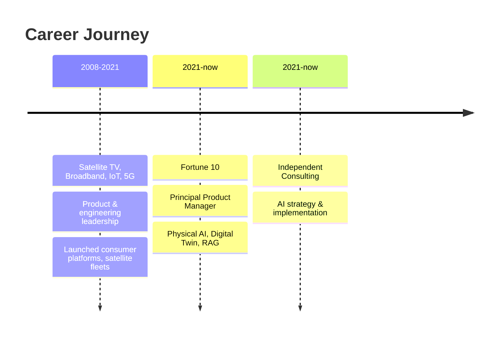

<!--
  ╔══════════════════════════════════════════════════╗
  ║  Hey there, fellow code-surfer! 🏄‍♂️              ║
  ║  You're reading the raw README of @v3nr1ck       ║
  ║  A PM who ships AI, not just PowerPoints.        ║
  ╚══════════════════════════════════════════════════╝
-->
<div align="center">

<!-- ANIMATED BANNER -->
<picture>
  <source media="(prefers-color-scheme: dark)" srcset="https://readme-typing-svg.demolab.com?font=Fira+Code&weight=700&size=32&duration=3500&pause=500&color=7C3AED&center=true&vCenter=true&width=800&height=100&lines=Hey%2C+I'm+James+%F0%9F%91%8B;Product+Manager+%2B+AI+Builder;Physical+AI+%C2%B7+Digital+Twin+%C2%B7+RAG" />
  <source media="(prefers-color-scheme: light)" srcset="https://readme-typing-svg.demolab.com?font=Fira+Code&weight=700&size=32&duration=3500&pause=500&color=6D28D9&center=true&vCenter=true&width=800&height=100&lines=Hey%2C+I'm+James+%F0%9F%91%8B;Product+Manager+%2B+AI+Builder;Physical+AI+%C2%B7+Digital+Twin+%C2%B7+RAG" />
  
</picture>

<br/>

<!-- ANIMATED SUBTITLE -->
<svg width="650" height="30" viewBox="0 0 650 30" xmlns="http://www.w3.org/2000/svg">
  <defs>
    <linearGradient id="subtitle-grad" x1="0%" y1="0%" x2="100%" y2="0%">
      <animate attributeName="x1" values="0%;100%;0%" dur="4s" repeatCount="indefinite"/>
      <animate attributeName="x2" values="100%;0%;100%" dur="4s" repeatCount="indefinite"/>
      <stop offset="0%" stop-color="#7C3AED"/>
      <stop offset="50%" stop-color="#EC4899"/>
      <stop offset="100%" stop-color="#7C3AED"/>
    </linearGradient>
  </defs>
  <text x="325" y="20" text-anchor="middle" fill="url(#subtitle-grad)" font-family="Segoe UI, system-ui, sans-serif" font-size="14" font-weight="500" letter-spacing="1.5">
    PRINCIPAL PRODUCT MANAGER · PHYSICAL AI · DIGITAL TWIN · ENTERPRISE PLATFORMS
  </text>
</svg>

<br/><br/>

<!-- QUICK STATS ROW -->
<p>
  
  
  
  
</p>

<br/>

<!-- PULSING DIVIDER -->
<svg width="120" height="4" viewBox="0 0 120 4" xmlns="http://www.w3.org/2000/svg">
  <rect x="0" y="0" width="120" height="4" rx="2" fill="#7C3AED" opacity="1">
    <animate attributeName="opacity" values="0.3;1;0.3" dur="2s" repeatCount="indefinite"/>
  </rect>
</svg>

</div>

<br/>

<!-- ============ ABOUT ME SECTION ============ -->
<h2>
  
  About Me
</h2>

> **Product + AI leader who doesn't just *talk* about AI — I build it.**  
> 18+ years of launching platforms, scaling operations, and shipping production AI systems.

I'm a **Principal Product Manager at a Fortune 10 company** leading **Physical AI, Digital Twin, and Predictive Analytics** platforms across thousands of locations globally. What makes me different? I don't just write PRDs — I write code that ships.

```python
class James:
    def __init__(self):
        self.role           = "Principal Product Manager @ Fortune 10"
        self.superpowers    = ["Physical AI", "Digital Twin", "RAG", "Agents"]
        self.ai_stack       = ["FAISS", "TensorFlow Lite", "LoRA/QLoRA", "Embeddings"]
        self.impact         = "Enterprise-scale platforms"
        self.years          = 18
        self.models_trained = 300  # and counting...
        self.coffee         = float("inf")

    def build(self, problem: str) -> "Solution":
        return Solution(
            strategy   = self.think_big(problem),
            prototype  = self.write_code(),
            production = self.ship_it()
        )
```

<br/>

<!-- ============ WHAT I DO ============ -->
<h2>
  
  What I Build
</h2>

<table>
<tr>
<td width="33%" align="center">
  <h3>🧠 Physical AI & Digital Twin</h3>
  <p align="left">
    <sub>
    • Led spatial intelligence generating <b>significant GMV impact</b><br/>
    • Simulation modeling + sensor telemetry + ML<br/>
    • Unified Physical AI platform across a Fortune 10's global footprint
    </sub>
  </p>
</td>
<td width="33%" align="center">
  <h3>🤖 AI Agents & RAG Systems</h3>
  <p align="left">
    <sub>
    • First-gen RAG engine: 3,000+ technical manuals<br/>
    • Multi-agent workflows adopted across a Fortune 10's AI ecosystem<br/>
    • Custom retrieval + orchestration at enterprise scale
    </sub>
  </p>
</td>
<td width="33%" align="center">
  <h3>📡 IoT & Predictive Ops</h3>
  <p align="left">
    <sub>
    • Enterprise IoT monitoring: <b>predictive failure detection at scale</b><br/>
    • Predictive HVAC/R failure detection at scale<br/>
    • Asset-to-failure intelligence models
    </sub>
  </p>
</td>
</tr>
</table>

<br/>

<!-- ============ TECH RADAR ============ -->
<h2>
  
  Tech & Tools
</h2>

<!-- Animated skill bars -->
<div align="center">

<svg width="700" height="320" viewBox="0 0 700 320" xmlns="http://www.w3.org/2000/svg">
  <defs>
    <linearGradient id="bar1" x1="0" y1="0" x2="1" y2="0">
      <stop offset="0%" stop-color="#7C3AED"/>
      <stop offset="100%" stop-color="#A78BFA"/>
    </linearGradient>
    <linearGradient id="bar2" x1="0" y1="0" x2="1" y2="0">
      <stop offset="0%" stop-color="#EC4899"/>
      <stop offset="100%" stop-color="#F472B6"/>
    </linearGradient>
    <linearGradient id="bar3" x1="0" y1="0" x2="1" y2="0">
      <stop offset="0%" stop-color="#10B981"/>
      <stop offset="100%" stop-color="#6EE7B7"/>
    </linearGradient>
    <linearGradient id="bar4" x1="0" y1="0" x2="1" y2="0">
      <stop offset="0%" stop-color="#3B82F6"/>
      <stop offset="100%" stop-color="#93C5FD"/>
    </linearGradient>
    <linearGradient id="bar5" x1="0" y1="0" x2="1" y2="0">
      <stop offset="0%" stop-color="#F59E0B"/>
      <stop offset="100%" stop-color="#FCD34D"/>
    </linearGradient>
    <filter id="glow">
      <feGaussianBlur stdDeviation="3" result="blur"/>
      <feMerge><feMergeNode in="blur"/><feMergeNode in="SourceGraphic"/></feMerge>
    </filter>
  </defs>

  <text x="0" y="24" fill="#E2E8F0" font-family="monospace" font-size="13">AI / ML Engineering</text>
  <rect x="0" y="34" width="600" height="12" rx="6" fill="#1E293B"/>
  <rect x="0" y="34" width="0" height="12" rx="6" fill="url(#bar1)" filter="url(#glow)">
    <animate attributeName="width" from="0" to="570" dur="1.5s" fill="freeze" begin="0.2s"/>
  </rect>

  <text x="0" y="84" fill="#E2E8F0" font-family="monospace" font-size="13">Product Strategy & Leadership</text>
  <rect x="0" y="94" width="600" height="12" rx="6" fill="#1E293B"/>
  <rect x="0" y="94" width="0" height="12" rx="6" fill="url(#bar2)" filter="url(#glow)">
    <animate attributeName="width" from="0" to="600" dur="1.5s" fill="freeze" begin="0.4s"/>
  </rect>

  <text x="0" y="144" fill="#E2E8F0" font-family="monospace" font-size="13">Enterprise Architecture</text>
  <rect x="0" y="154" width="600" height="12" rx="6" fill="#1E293B"/>
  <rect x="0" y="154" width="0" height="12" rx="6" fill="url(#bar3)" filter="url(#glow)">
    <animate attributeName="width" from="0" to="540" dur="1.5s" fill="freeze" begin="0.6s"/>
  </rect>

  <text x="0" y="204" fill="#E2E8F0" font-family="monospace" font-size="13">IoT & Sensor Networks</text>
  <rect x="0" y="214" width="600" height="12" rx="6" fill="#1E293B"/>
  <rect x="0" y="214" width="0" height="12" rx="6" fill="url(#bar4)" filter="url(#glow)">
    <animate attributeName="width" from="0" to="510" dur="1.5s" fill="freeze" begin="0.8s"/>
  </rect>

  <text x="0" y="264" fill="#E2E8F0" font-family="monospace" font-size="13">Cloud-Native / 5G / Telecom</text>
  <rect x="0" y="274" width="600" height="12" rx="6" fill="#1E293B"/>
  <rect x="0" y="274" width="0" height="12" rx="6" fill="url(#bar5)" filter="url(#glow)">
    <animate attributeName="width" from="0" to="540" dur="1.5s" fill="freeze" begin="1.0s"/>
  </rect>
</svg>

</div>

<br/>

<!-- ============ GITHUB STATS ============ -->
<h2>
  
  GitHub Analytics
</h2>

<div align="center">
  <a href="https://github.com/v3nr1ck">
    
    
  </a>
</div>

<br/>

<!-- ============ CAREER TIMELINE ============ -->
<h2>
  
  Career Journey
</h2>

<div align="center">



</div>

<br/>

<!-- ============ NUMBERS THAT MATTER ============ -->
<h2>
  
  Impact by the Numbers
</h2>

<div align="center">

<!-- ANIMATED COUNTER CARDS — Row 1 -->
<svg width="700" height="160" viewBox="0 0 700 160" xmlns="http://www.w3.org/2000/svg">
  <defs>
    <filter id="card-shadow">
      <feDropShadow dx="0" dy="4" stdDeviation="6" flood-color="#000000" flood-opacity="0.3"/>
    </filter>
  </defs>

  <!-- Card 1 -->
  <rect x="10" y="10" width="215" height="140" rx="12" fill="#1E293B" stroke="#7C3AED" stroke-width="1.5" filter="url(#card-shadow)" opacity="0">
    <animate attributeName="opacity" from="0" to="1" dur="0.6s" fill="freeze" begin="0.2s"/>
  </rect>
  <text x="117" y="55" text-anchor="middle" fill="#7C3AED" font-family="monospace" font-size="28" font-weight="bold" opacity="0">
    3,000+
    <animate attributeName="opacity" from="0" to="1" dur="0.6s" fill="freeze" begin="0.4s"/>
  </text>
  <text x="117" y="85" text-anchor="middle" fill="#9CA3AF" font-family="system-ui, sans-serif" font-size="11" opacity="0">
    Technical Manuals
    <animate attributeName="opacity" from="0" to="1" dur="0.6s" fill="freeze" begin="0.4s"/>
  </text>
  <text x="117" y="105" text-anchor="middle" fill="#6B7280" font-family="system-ui, sans-serif" font-size="10" opacity="0">
    RAG-powered AI Assistant
    <animate attributeName="opacity" from="0" to="1" dur="0.6s" fill="freeze" begin="0.4s"/>
  </text>

  <!-- Card 2 -->
  <rect x="240" y="10" width="215" height="140" rx="12" fill="#1E293B" stroke="#EC4899" stroke-width="1.5" filter="url(#card-shadow)" opacity="0">
    <animate attributeName="opacity" from="0" to="1" dur="0.6s" fill="freeze" begin="0.4s"/>
  </rect>
  <text x="347" y="55" text-anchor="middle" fill="#EC4899" font-family="monospace" font-size="28" font-weight="bold" opacity="0">
    15M+
    <animate attributeName="opacity" from="0" to="1" dur="0.6s" fill="freeze" begin="0.6s"/>
  </text>
  <text x="347" y="85" text-anchor="middle" fill="#9CA3AF" font-family="system-ui, sans-serif" font-size="11" opacity="0">
    Annual Work Orders
    <animate attributeName="opacity" from="0" to="1" dur="0.6s" fill="freeze" begin="0.6s"/>
  </text>
  <text x="347" y="105" text-anchor="middle" fill="#6B7280" font-family="system-ui, sans-serif" font-size="10" opacity="0">
    Enterprise Platforms
    <animate attributeName="opacity" from="0" to="1" dur="0.6s" fill="freeze" begin="0.6s"/>
  </text>

  <!-- Card 3 -->
  <rect x="470" y="10" width="220" height="140" rx="12" fill="#1E293B" stroke="#10B981" stroke-width="1.5" filter="url(#card-shadow)" opacity="0">
    <animate attributeName="opacity" from="0" to="1" dur="0.6s" fill="freeze" begin="0.6s"/>
  </rect>
  <text x="580" y="55" text-anchor="middle" fill="#10B981" font-family="monospace" font-size="28" font-weight="bold" opacity="0">
    300+
    <animate attributeName="opacity" from="0" to="1" dur="0.6s" fill="freeze" begin="0.8s"/>
  </text>
  <text x="580" y="85" text-anchor="middle" fill="#9CA3AF" font-family="system-ui, sans-serif" font-size="11" opacity="0">
    LoRA/QLoRA Models
    <animate attributeName="opacity" from="0" to="1" dur="0.6s" fill="freeze" begin="0.8s"/>
  </text>
  <text x="580" y="105" text-anchor="middle" fill="#6B7280" font-family="system-ui, sans-serif" font-size="10" opacity="0">
    Trained & Fine-tuned
    <animate attributeName="opacity" from="0" to="1" dur="0.6s" fill="freeze" begin="0.8s"/>
  </text>
</svg>

<!-- ANIMATED COUNTER CARDS — Row 2 -->
<svg width="700" height="160" viewBox="0 0 700 160" xmlns="http://www.w3.org/2000/svg">
  <defs>
    <filter id="card-shadow2">
      <feDropShadow dx="0" dy="4" stdDeviation="6" flood-color="#000000" flood-opacity="0.3"/>
    </filter>
    <linearGradient id="gold-grad" x1="0%" y1="0%" x2="100%" y2="100%">
      <stop offset="0%" stop-color="#F59E0B"/>
      <stop offset="100%" stop-color="#FCD34D"/>
    </linearGradient>
  </defs>

  <!-- Hero Card: $2.5B+ -->
  <rect x="10" y="10" width="215" height="140" rx="12" fill="#1E293B" stroke="url(#gold-grad)" stroke-width="2" filter="url(#card-shadow2)" opacity="0">
    <animate attributeName="opacity" from="0" to="1" dur="0.6s" fill="freeze" begin="0.2s"/>
  </rect>
  <text x="117" y="50" text-anchor="middle" fill="#F59E0B" font-family="monospace" font-size="26" font-weight="bold" opacity="0">
    $2.5B+
    <animate attributeName="opacity" from="0" to="1" dur="0.6s" fill="freeze" begin="0.4s"/>
  </text>
  <text x="117" y="80" text-anchor="middle" fill="#9CA3AF" font-family="system-ui, sans-serif" font-size="11" opacity="0">
    Total Annual Revenue
    <animate attributeName="opacity" from="0" to="1" dur="0.6s" fill="freeze" begin="0.4s"/>
  </text>
  <text x="117" y="95" text-anchor="middle" fill="#9CA3AF" font-family="system-ui, sans-serif" font-size="11" opacity="0">
    Impact
    <animate attributeName="opacity" from="0" to="1" dur="0.6s" fill="freeze" begin="0.4s"/>
  </text>
  <text x="117" y="120" text-anchor="middle" fill="#6B7280" font-family="system-ui, sans-serif" font-size="10" opacity="0">
    Product &amp; AI Initiatives
    <animate attributeName="opacity" from="0" to="1" dur="0.6s" fill="freeze" begin="0.4s"/>
  </text>

  <!-- Card 5: 100B+ -->
  <rect x="240" y="10" width="215" height="140" rx="12" fill="#1E293B" stroke="#3B82F6" stroke-width="1.5" filter="url(#card-shadow2)" opacity="0">
    <animate attributeName="opacity" from="0" to="1" dur="0.6s" fill="freeze" begin="0.6s"/>
  </rect>
  <text x="347" y="55" text-anchor="middle" fill="#3B82F6" font-family="monospace" font-size="28" font-weight="bold" opacity="0">
    100B+
    <animate attributeName="opacity" from="0" to="1" dur="0.6s" fill="freeze" begin="0.8s"/>
  </text>
  <text x="347" y="85" text-anchor="middle" fill="#9CA3AF" font-family="system-ui, sans-serif" font-size="11" opacity="0">
    Param Models
    <animate attributeName="opacity" from="0" to="1" dur="0.6s" fill="freeze" begin="0.8s"/>
  </text>
  <text x="347" y="105" text-anchor="middle" fill="#6B7280" font-family="system-ui, sans-serif" font-size="10" opacity="0">
    Local AI Infrastructure
    <animate attributeName="opacity" from="0" to="1" dur="0.6s" fill="freeze" begin="0.8s"/>
  </text>

  <!-- Card 6: 18+ Years -->
  <rect x="470" y="10" width="220" height="140" rx="12" fill="#1E293B" stroke="#8B5CF6" stroke-width="1.5" filter="url(#card-shadow2)" opacity="0">
    <animate attributeName="opacity" from="0" to="1" dur="0.6s" fill="freeze" begin="0.8s"/>
  </rect>
  <text x="580" y="55" text-anchor="middle" fill="#8B5CF6" font-family="monospace" font-size="28" font-weight="bold" opacity="0">
    18+
    <animate attributeName="opacity" from="0" to="1" dur="0.6s" fill="freeze" begin="1.0s"/>
  </text>
  <text x="580" y="85" text-anchor="middle" fill="#9CA3AF" font-family="system-ui, sans-serif" font-size="11" opacity="0">
    Years Experience
    <animate attributeName="opacity" from="0" to="1" dur="0.6s" fill="freeze" begin="1.0s"/>
  </text>
  <text x="580" y="105" text-anchor="middle" fill="#6B7280" font-family="system-ui, sans-serif" font-size="10" opacity="0">
    Product &amp; AI Leadership
    <animate attributeName="opacity" from="0" to="1" dur="0.6s" fill="freeze" begin="1.0s"/>
  </text>
</svg>

</div>

<br/>

<!-- ============ CURRENT FOCUS ============ -->
<h2>
  
  Current Focus
</h2>

```text
🚀 Physical AI Platform ── building the digital twin backbone for a Fortune 10's global operations
🧠 AI Agents ── shipping multi-agent systems that actually work in production
📡 Spatial Intelligence ── item-location modeling that drives real GMV
🔧 Open Source ── building in public, sharing what I learn
```

<br/>

<!-- ============ CONNECT ============ -->
<h2>
  
  Let's Connect
</h2>

<div align="center">
  <a href="https://linkedin.com/in/jamesven">
    
  </a>
  <a href="mailto:venrick@gmail.com">
    
  </a>
  <a href="https://github.com/v3nr1ck">
    
  </a>
</div>

<br/>

<!-- ============ FUN FOOTER ============ -->
<div align="center">

<svg width="500" height="60" viewBox="0 0 500 60" xmlns="http://www.w3.org/2000/svg">
  <defs>
    <linearGradient id="footer-grad" x1="0%" y1="0%" x2="100%" y2="0%">
      <animate attributeName="x1" values="0%;100%;0%" dur="3s" repeatCount="indefinite"/>
      <animate attributeName="x2" values="100%;0%;100%" dur="3s" repeatCount="indefinite"/>
      <stop offset="0%" stop-color="#7C3AED"/>
      <stop offset="50%" stop-color="#EC4899"/>
      <stop offset="100%" stop-color="#7C3AED"/>
    </linearGradient>
  </defs>
  <text x="250" y="30" text-anchor="middle" fill="url(#footer-grad)" font-family="monospace" font-size="12" letter-spacing="2">
    ⚡ BUILT WITH AI · SHIPPED BY A PM WHO CODES ⚡
  </text>
  <text x="250" y="50" text-anchor="middle" fill="#6B7280" font-family="monospace" font-size="10">
    "Not all product managers just make slides."
  </text>
</svg>

<br/>

<p>
  
</p>

</div>
